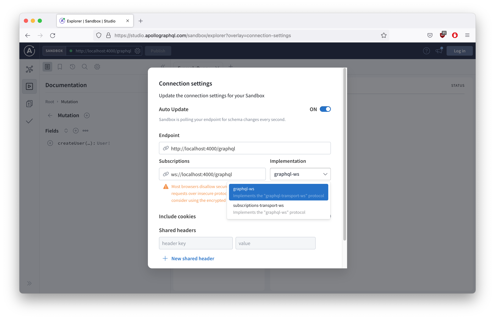

# GraphQL Subscription At Scale Using WebSocket And Redis

## Dependencies

```console
  "dependencies": {
    "@graphql-tools/schema": "8.3.13",
    "apollo-server-core": "3.8.2",
    "apollo-server-errors": "3.3.1",
    "apollo-server-express": "3.6.7",
    "graphql": "15.7.2",
    "graphql-redis-subscriptions": "2.4.2",
    "graphql-ws": "5.8.2",
    "ioredis": "5.0.6",
    "ws": "8.7.0"
  },
```

## Trying it out

Install libraries...
```console
npm install
```

Run it
```console
npm run start

> graphql-apollo@1.0.0 start
> nodemon src/index.js --ext js, --exec babel-node

[nodemon] 2.0.2
[nodemon] to restart at any time, enter `rs`
[nodemon] watching dir(s): *.*
[nodemon] watching extensions: js
[nodemon] starting `babel-node src/index.js`
🚀 Server ready at http://localhost:4000/graphql
```

Launch Apollo Studio...


Click 'Query your server'.

Change Subscription Implementation to `graphql-ws`. Click the gear icon beside sandbox url.



Initiate `user` subscription.


Create a user.
